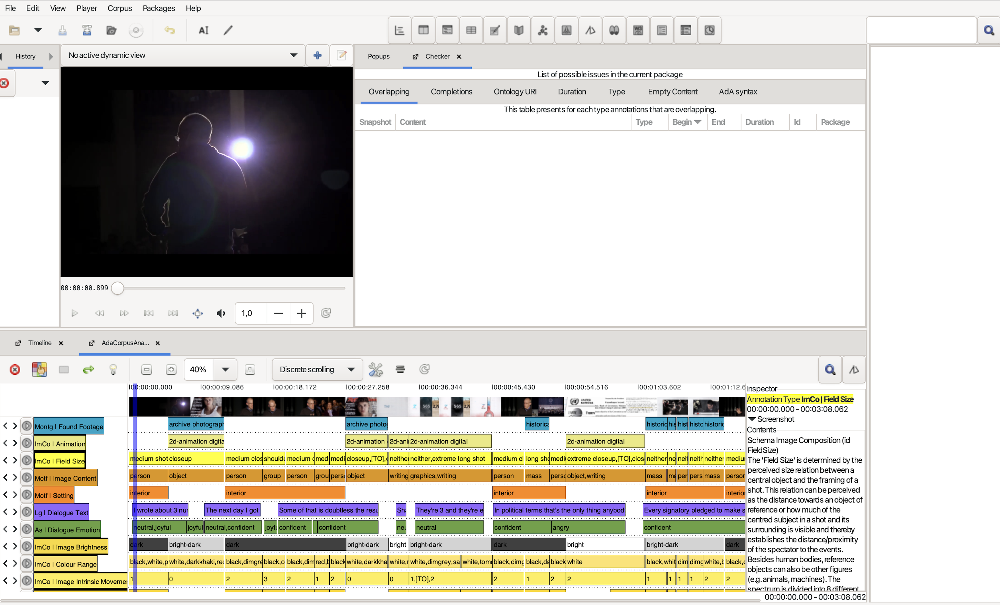
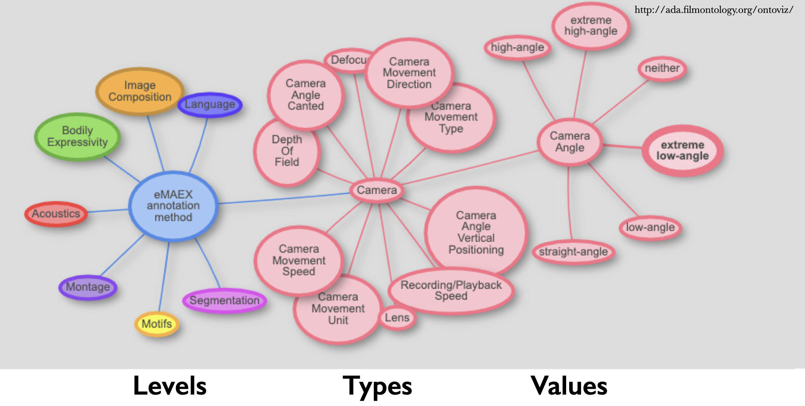

# Annotation Data

As part of the research on the climate change film corpus, the project created annotation packages.

The dataset consists of 78 annotation packages in `azp` and `json` formats.

The annotations systematically document audiovisual patterns in the corpus — such as camera movement, editing rhythm, color, and sound — using controlled vocabularies and structured data formats. Each annotation package corresponds to one corpus object which is made identifiable via the `object_id`.

## Tools and Method

### Advene

The annotations were created with [Advene](https://www.advene.org/), an open-source tool for annotating and analysing audiovisual resources. Advene allows users to create timeline-based annotations linked directly to video timecodes and export them in multiple formats.

An example of the annotation interface using the AdA Ontology is shown below:

### AdA Filmontology

The annotation schema is based on the [AdA Filmontology](https://projectada.github.io/ontology/), a systematic vocabulary and data model of film-analytical terms and concepts for fine-grained semantic video annotation. It provides standardised categories and values for describing audiovisual patterns, enabling systematic and reproducible analysis across different corpora.

The film-analytical concepts, terms, and descriptions are defined using OWL (Web Ontology Language) and RDF (Resource Description Framework) within a threefold class-based structure and its associated properties:

**Annotation levels** are general descriptive categories consisting of a set of related annotation types (e.g. acoustics or camera).

**Annotation types** are concepts used for film analysis under which a film is annotated (e.g. music ➡️ mood or camera movement ➡️ tempo).

**Annotation values** describe the specific properties that an annotation type can assume (e.g. camera movement ➡️ tempo ➡️ slow, medium, fast, variable).

An example of the ontology structure is displayed below: 

### AdA Toolkit

The [AdA Toolkit](https://www.ada.cinepoetics.fu-berlin.de/en/ada-toolkit/index.html) provides full documentation and resources for working with the AdA Filmontology and Advene, including:

* [Manual: Annotating with Advene and the AdA Filmontology](https://github.com/ProjectAdA/public/tree/master/manuals)
* [AdA Filmontology – Levels, Types, Values](https://github.com/ProjectAdA/public/tree/master/manuals)
* [Notes on collaborative annotation with the AdA Filmontology](https://github.com/ProjectAdA/public/tree/master/manuals)
* [AdA Template for Advene](https://github.com/ProjectAdA/public) (predefined vocabulary for direct use in Advene)
* [Video tutorials](https://www.cinepoetics.fu-berlin.de/en/methods/3_Tools/3_Documentation_AdA_Toolkit/index.html)

## How to use the annotation files

1. Install Advene: [advene.org](https://www.advene.org/)
2. Download the [AdA Template](https://github.com/ProjectAdA/public) from the AdA Toolkit
3. Open an `azp` file in Advene via **File → Open**
4. To view annotations linked to video, you will need the corresponding video file
   (not included due to copyright restrictions)
5. `.json` files can be opened with any text editor or processed with Python

For detailed workflows and descriptions please use the manual or the video tutorials. 

## License

The annotation data are licensed under **CC BY 4.0**. See [LICENSE.md](../LICENSE.md) for details.