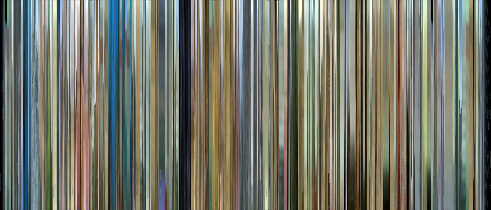

## What are Moviebarcodes?

Moviebarcodes are schematic visual representations of the chromatic and luminance properties of moving-image material over time. Arranged horizontally from left to right, they map the temporal progression of a film’s or film-segment's colors and brightness values across its duration (Stratil 2024; Burghardt, Kao, Wolff 2016). The vertical axis represents the vertical distribution of these color and luminance values within the image frame.

In this way, moviebarcodes condense the color and brightness progressions of a time-based audiovisual work into a single, static image that preserves temporal order while abstracting from representational detail. While alternative mappings—such as swapping the temporal and spatial axes—are possible and may be analytically useful in specific cases, the guides accompanying this project focus exclusively on the configuration described above.

## How are Moviebarcodes generated?

Moviebarcodes are created in a multi-step process. First, individual frames are extracted from a video at regular intervals. Each extracted frame is then reduced to the width of one pixel, effectively averaging the color and luminance values of the frame along one spatial dimension. These pixel-wide abstractions are subsequently arranged horizontally according to their position in the films’s or clip's runtime, resulting in a composite image that abstracts and visualizes the film's/clip's temporal structure.

We use the free and open-source tools ffmpeg and ImageMagick to generate the moviebarcodes. Other methods are possible and may lead to slightly different outcomes. For the purposes of this project, however, this approach was chosen because it produces results that are reproducible, methodologically transparent, and easy to trace step by step. Detailed instructions for the workflow can be found in the respective tutorials.

## Why use Moviebarcodes in film analysis?

Moviebarcodes can serve as an analytical tool as well as a means of visual communication in film studies. On a macro-analytical level, they function as condensed visual signatures of films, providing scholars with a rapid overview of a film’s dominant color and brightness patterns. This makes it possible to compare large numbers of films on a highly abstract level, for instance across genres, periods, or stylistic tendencies (Burghardt, Kao, Walkowski 2018).

Moviebarcodes are particularly useful for tracing movements and modulations of visual composition through the progression of the barcode’s temporal axis. As analytical aids, they allow scholars to grasp at a glance how rhythms, repetitive structures, and gradual developments unfold over time on the level of color and luminance (Stratil 2024). Crucially, these temporal patterns can be observed independently of representational content, enabling an abstracted analysis of visual dynamics that foregrounds formal organization rather than depicted objects or representational elements.

Conversely, moviebarcodes are well suited as illustrative devices in scholarly argumentation. They can support analyses that assume audiovisual composition—that is, the concrete temporal arrangement of images and sounds—as a formal and aesthetic matrix shaping both processes of understanding and affective experience in spectators (Bakels, Grotkopp, Scherer, Stratil 2020; also see Müller/Kappelhoff 2018). In this sense, moviebarcodes can help to visualize how meaning and emotion emerge from the temporal organization of moving images, rather than from isolated stills or representational elements alone (Stratil 2024).

## References

Bakels, J.‑H., Grotkopp, M., Scherer, T. J. J., & Stratil, J. (2020). Digitale Empirie? Computergestützte Filmanalyse im Spannungsfeld von Datenmodellen und Gestalttheorie. Advance online publication. https://doi.org/10.25969/mediarep/21683

Burghardt, M., Kao, M., & Walkowski, N.-O. (2018). *Scalable movie barcodes: An exploratory interface for the analysis of movies*. In Proceedings of the IEEE VIS Workshop on Visualization for the Digital Humanities.

Burghardt, M., Kao, M., & Wolff, C. (2016). Beyond shot lengths: Using language data and color information as additional parameters for quantitative movie analysis. In *Digital Humanities 2016: Conference abstracts* (pp. 753–755). Jagiellonian University & Pedagogical University.

Kappelhoff, H., & Müller, C. (2018). *Cinematic metaphor: Experience, affectivity, temporality.* De Gruyter. 

Stratil, J. (2019). „Ja es ist wieder Zeit für so ein Video.“: Zur audiovisuellen Adressierung und rhetorischen Situation des Rezo-YouTube-Videos „Die Zerstörung der CDU.“. *Mediaesthetics – Zeitschrift für Poetologien audiovisueller Bilder, 3.* https://doi.org/10.17169/mae.2019.83

Stratil, J. (2024). *Audiovisuelle Rhetorik als politische Intervention.* De Gruyter. https://doi.org/10.1515/9783111420028
